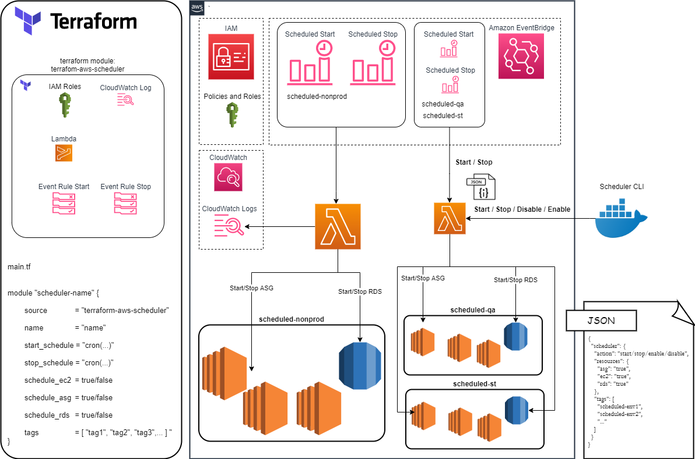

## Table of contents

- [Solution Overview](#solution-overview)
  - [Lambda Function](#lambda-function)
  - [Actions and Tags](#actions-tags)
  - [Scheduled Triggers](#scheduled-triggers)
  - [Scheduler Cli](#scheduler-cli)
- [Architecture Diagram](#architecture-diagram)
- [Prerequisites](#prerequisites)
- [AWS Scheduler Terraform Module](#terraform-module)
- [Scheduler Cli Usage](#scheduler-cli-usage)
- [Build Example](#build-example)

# Solution Overview
<a name="solution-overview"></a>
The package provides solution for shutting down and starting up AWS resources automatically at scheduled times and (or) manually on demand. The following AWS resources are supported:
* EC2 Instances 
* Auto Scaling Groups  
* RDS Instances and Clusters

## Lambda Function
<a name="lambda-function"></a>
The core functionality is provided by AWS Lambda function which is processing events based on:
* action - a command to be performed. It can be one of the following:  
  **start**: start resources  
  **stop**: stop resources  
  **enable**: enable resources for start and stop  
  **disable**: disable resources from start and stop 

* resources - types of resources for actioning. It can be one of the following:  
  **ec2**: EC2 Instances  
  **asg**: Auto Scaling Groups  
  **rds**: RDS Instances and Clusters  

* tags - it is a list of AWS resource tags.  


The events describing action, resources and tags are sent to Lambda function in the JSON format:  

```
{
	"mode": "start|stop|enable|disable", 
	"resource": {	
		"ec2": true|false,	
		"rds": true|false, 
		"asg": true|false 
	}, 
	"tags": [ "tag-1", "tag-2", "..." ]
}
```
Example:
```json
{
	"mode": "start", 
	"resource": {	
		"ec2": true,	
		"rds": true, 
		"asg": false 
	}, 
	"tags": [ "scheduled-dev", "scheduled-tst" ]
}
```
## Actions and Tags
<a name="actions-tags"></a>
Each resource containing a tag with the key equal to one of the listed tags and value equal to **true** is the target of the **start**, **stop** and **disable** action. For example:  
**start** action on **ec2** resource with **scheduled-dev** tag is going to start-up all EC2 instances containing tags where "key" = "scheduled-dev" and "value" = "true".  
**stop** action is going to stop all EC2 instances with those tags.  
**disable** action is going to target all EC2 instances with those tags in order to change the tag value from **true** to **false**.  
On the other hand **enable** action is going to target all EC2 instances with tags where "key" = "scheduled-dev" and "value" = "false" in order to change the tag value from **false** to **true**.  


## Scheduled Triggers
<a name="scheduled-triggers"></a>
Lambda function triggers are setup as Amazon EventBridge Rules. One rule self triggers Lambda **start** action and one rule self triggers Lambda **stop** action.  
Both rules are configured as automated event schedules described as cron expressions. 

## Scheduler Cli 
<a name="scheduler-cli"></a>
Scheduler Command Line Interface enables to trigger on demand any action supported by Lambda function: **start**, **stop**, **enable**, **disable**.  
It is a python application deployed in a docker container. It supports cli arguments as well as interactive mode of operation when run without any arguments.  

# Architecture Diagram
<a name="architecture-diagram"></a>


## Prerequisites
<a name="prerequisites"></a>
* Terrafom >= 0.15.5 
* AWS Cli >= 2.2

# AWS Scheduler Terraform Module
<a name="terraform-module"></a>
Terraform module creates Lambda function with required IAM policies and roles and two EventBridge rules.

## Usage

```hcl
module "module-name" {
  source          = "terraform-aws-scheduler"
  name            = "scheduler-name"
  start_schedule  = "cron(* * * * * *)"
  stop_schedule   = "cron(* * * * * *)" 
  schedule_ec2    = true|false
  schedule_asg    = true|false
  schedule_rds    = true|false
  schedule_tags   = [ "tag-1", "tag-2", "..."  ]
}
```


## Example
AWS Scheduler for office hours. It starts resources up at 9AM and shuts them down at 5PM from Monday to Friday.  

```hcl
module "my-scheduler" {
  source          = "terraform-aws-scheduler"
  name            = "my-scheduler"
  start_schedule  = "cron(0 9 ? * MON-FRI *)"
  stop_schedule   = "cron(0 17 ? * MON-FRI *)" 
  schedule_ec2    = true
  schedule_asg    = true
  schedule_rds    = true
  schedule_tags   = [ "scheduled-dev", "scheduled-tst"  ]
}
```

# Requirements

| Name | Version |
|------|---------|
| <a name="requirement_terraform"></a> [terraform](#requirement\_terraform) | >= 0.12 |
| <a name="requirement_aws"></a> [aws](#requirement\_aws) | >= 3.55 |

## Providers

| Name | Version |
|------|---------|
| <a name="provider_aws"></a> [aws](#provider\_aws) | >= 3.55 |
| <a name="provider_archive"></a> [archive](#provider\_archive) | >= 2.0.0 |

## Inputs

| Name | Description | Type | Default | Required |
|------|-------------|------|---------|:--------:|
| <a name="input_name"></a> [name](#input\_name) | Name assigned to Lambda function. | `string` | `null` | yes |
| <a name="input_start_schedule"></a> [start\_schedule](#input\_start\_schedule) | Cron expression describing schedule of auto triggered Start action. | `string` | `null` | yes |
| <a name="input_stop_schedule"></a> [stop\_schedule](#input\_stop\_schedule) | Cron expression describing schedule of auto triggered Stop action | `string` | `null` | yes |
| <a name="input_schedule_ec2"></a> [schedule\_ec2](#input\_schedule\_ec2) | Controls if EC2 Instances are to be considered for scheduling | `bool` | `false` | no |
| <a name="input_schedule_asg"></a> [schedule\_asg](#input\_schedule\_asg) | Controls if Auto Scaling Groups are to be considered for scheduling | `bool` | `false` | no |
| <a name="input_schedule_rds"></a> [schedule\_rds](#input\_schedule\_rds) | Controls if RDS Instances and Clusters are to be considered for scheduling | `bool` | `false` | no |
| <a name="input_schedule_tags"></a> [schedule\_rds](#input\_schedule\_rds) | Specifies key name of resources  scheduling | `bool` | `false` | no |
| <a name="input_permissions_boundary"></a> [permissions\_boundary](#input\_permissions\_boundary) | Lambda function permissions boundary | `string` | `null` | no |

## Outputs

| Name | Description |
|------|-------------|
| <a name="output_lambda_iam_role_arn"></a> [lambda\_iam\_role\_arn](#output\_lambda\_iam\role\_arn) | The ARN of the lambda role. |
| <a name="output_lambda_iam_role_name"></a> [lambda\_iam\_role\_name](#output\_lambda\_iam\role\_name) | The name of the lambda role. |
| <a name="output_lambda_arn"></a> [lambda\_arn](#output\_lambda\_arn) | The ARN of the lambda function. |
| <a name="output_lambda_name"></a> [lambda\_name](#output\_lambda\_name) | The name of the lambda function. |
| <a name="output_lambda_invoke_arn"></a> [lambda\_invoke\_arn](#output\_lambda\_invoke\_arn) | The Invoke ARN of the lambda function. |
| <a name="output_log_group_arn"></a> [log\_group\_arn](#output\_log\_group\_arn) | The ARN of the log group. |
| <a name="output_log_group_name"></a> [log\_group\_name](#output\_log\_group\_name) | The name of the log group. |


### Scheduler Cli Usage:
<a name="scheduler-cli"></a>

```
docker run aws-scheduler-cli --help 
```
```
usage: app.py [-h] -n NAME -a {start,stop,enable,disable} [-e] [-g] [-r] -t TAGS [TAGS ...]

Invoke Lambda Scheduler

optional arguments:
  -h, --help            show this help message and exit
  -n NAME, --name NAME  name of the lambda function to trigger
  -a {start,stop,enable,disable}, --action {start,stop,enable,disable}
                        action to trigger
  -e, --ec2             process ec2
  -g, --asg             process asg
  -r, --rds             process rds
  -t TAGS [TAGS ...], --tags TAGS [TAGS ...] resource tags to act on
usage: app.py [-h] -n NAME -a {start,stop,enable,disable} [-e] [-g] [-r] -t TAGS [TAGS ...]

```
### Interactive Usage:
```
docker run -it aws-scheduler-cli 
```
```
Which lambda function would you like to trigger? 
Name: my-scheduler

Which lambda action would you like to trigger?
          1. start
          2. stop
          3. enable
          4. disable
Choice: 1

Would you like to process EC2s?
          1. yes
          2. no
Choice: 1

Would you like to process ASGs?
          1. yes
          2. no
Choice: 1

Would you like to process RDSs?
          1. yes
          2. no
Choice: 1

Which tags would you like to target?
List of tags: scheduled-tst
```

# Build Example 
<a name="build-example"></a>

Build test resources and example scheduler to operate on them.

## Provision Test AWS resources

* Initialize terraform for test resources:
```
make test-infra-init
```

* Deploy test resources with terraform:
```
make test-infra-deploy
```

Note: it is possible to define exact numbers of certain resources provisioned in test framework by changing their counts in the file:  
./examples/test-infra/terrform.tfvars

## Provision Example AWS Scheduler 

* Initialize terraform for aws scheduler:
```
make scheduler-init
```

* Deploy scheduler with terraform:
```
make scheduler-deploy
```
## Build AWS Scheduler Cli

Scheduler Cli can trigger lambda function actions on demand.  
* Build docker image of aws-scheduler-cli:
```
make cli-build 
```
## Test AWS Scheduler

* Run scheduler actions: start, stop, enable, disable:
```
make scheduler-test 
```


